# RecipeBook

## A web app built with ASP.NET Core and React for creating and sharing recipes for meals

For the best experience it is recommended to run the API server with .NET 6 installed

## How to run the app

1. Clone the repository to your machine.
2. Start the API solution.
3. Open the react project directory (/Client subfolder) and run the command
   "npm install" to install all dependancies.
4. After that start the client app with "npm start".

## Users and permissions

1. Visitors (loget out users) - can view recipes, a list of users and their profiles, as well as register.
2. Loged in users - can access the same functionality that users can in addition to creating a new recipe, editing and deleting recipes, as the homepage being their profile page.

## Structure

### Visitors (loged out users):

1. Home Page (url - "/")
   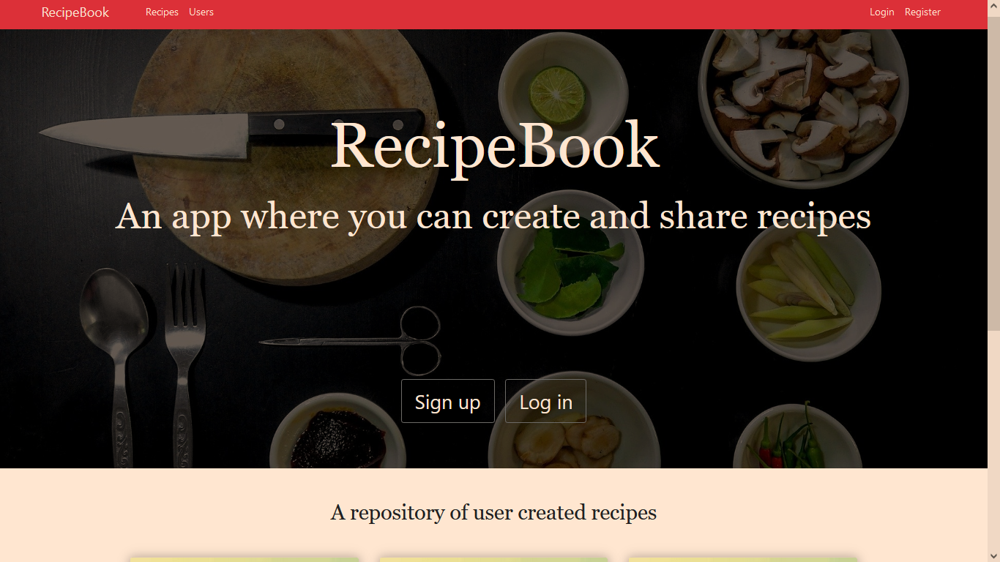
   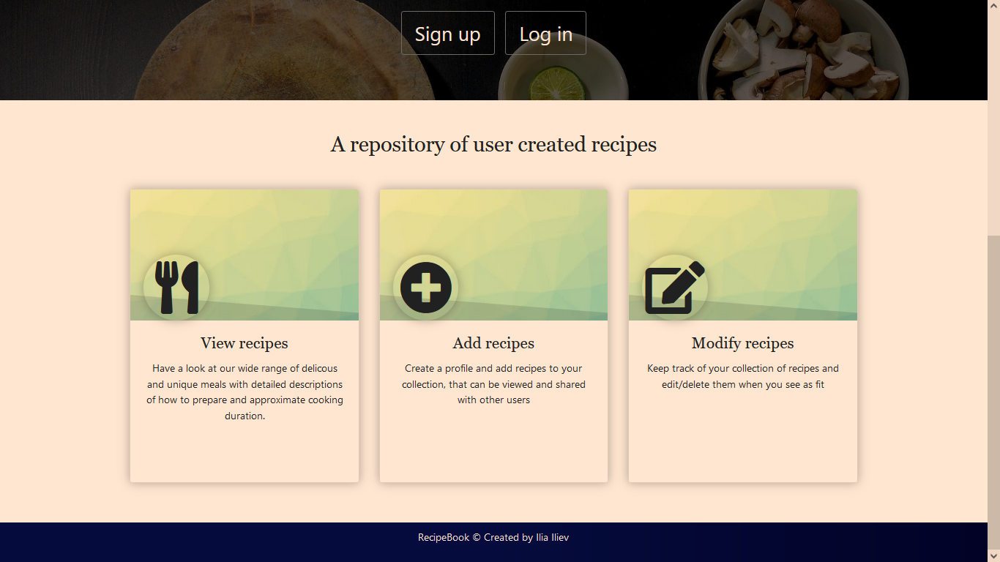
2. Recipes Catalog (url - "/recipes")
   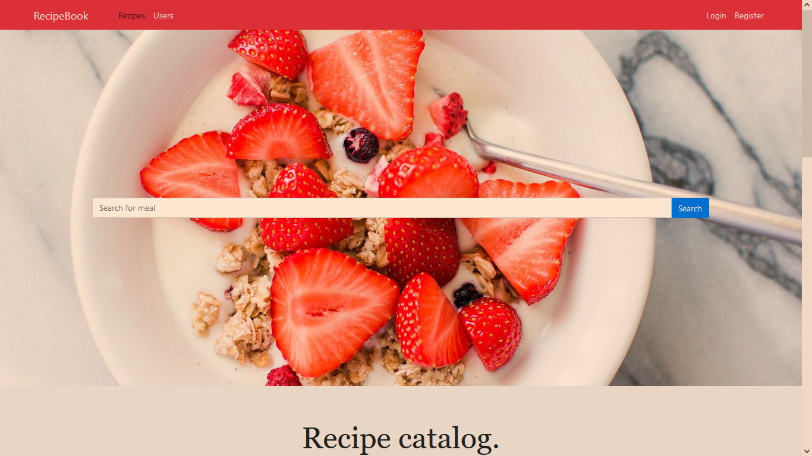
   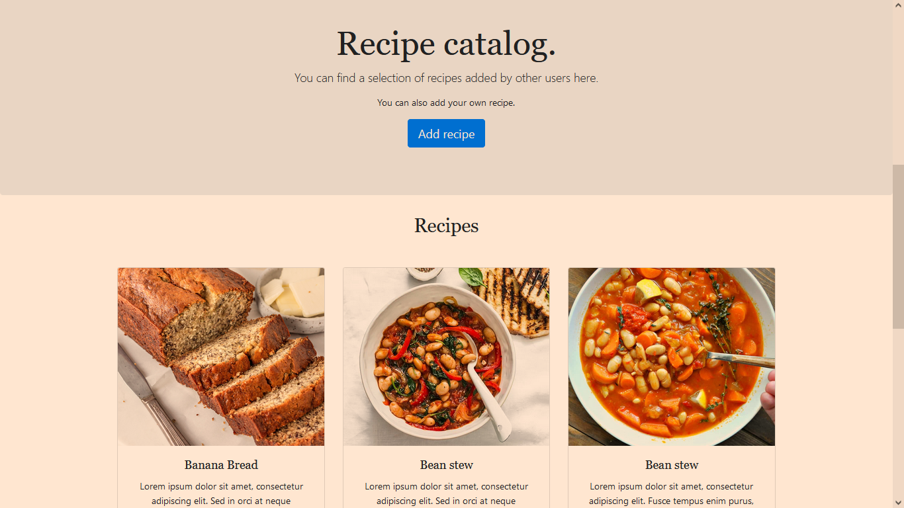
3. Recipe Details (url - "/recipe/:id")
   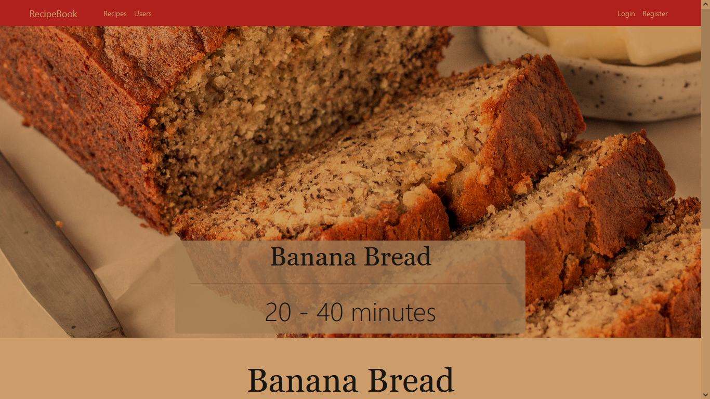
   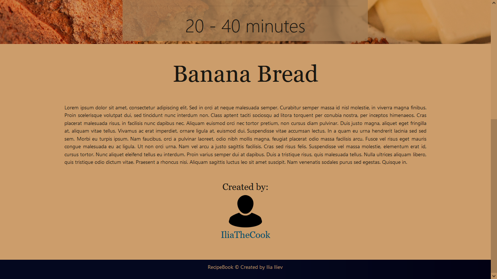
4. Login Form (url - "/login")
   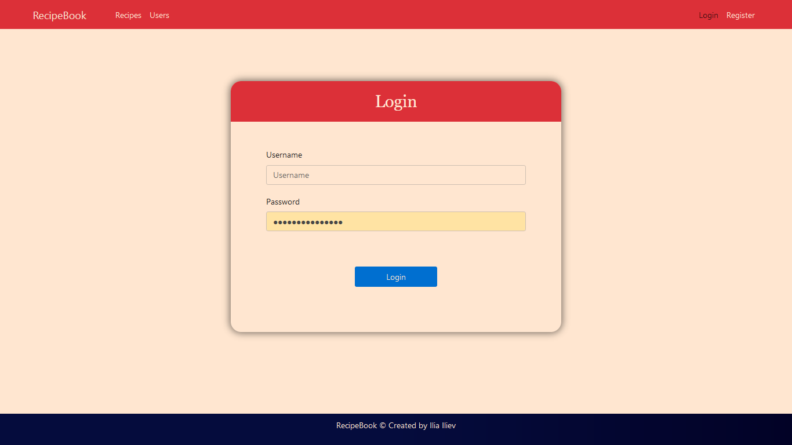
5. Register Form (url - "/register")
   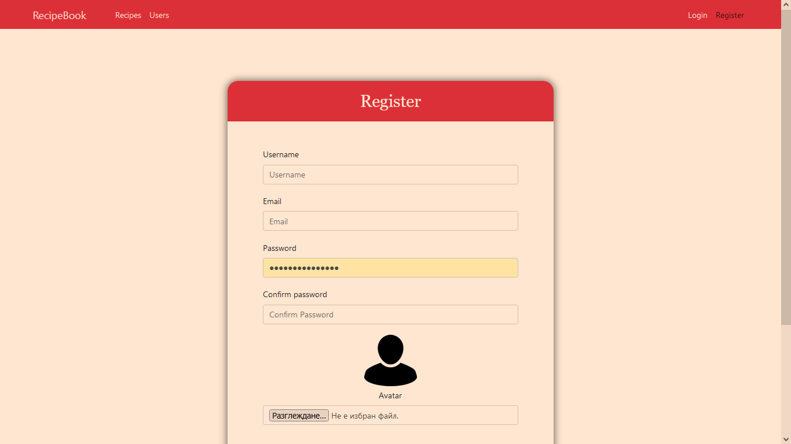
6. Users Catalog (url - "/users")
   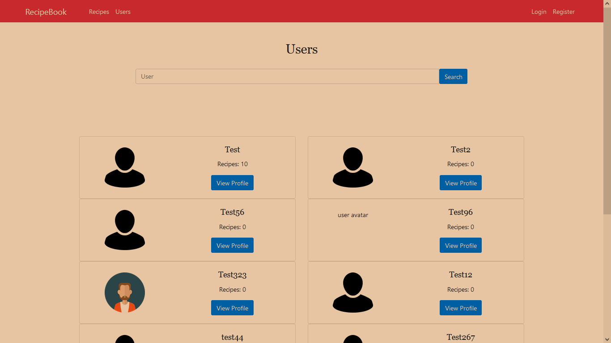
   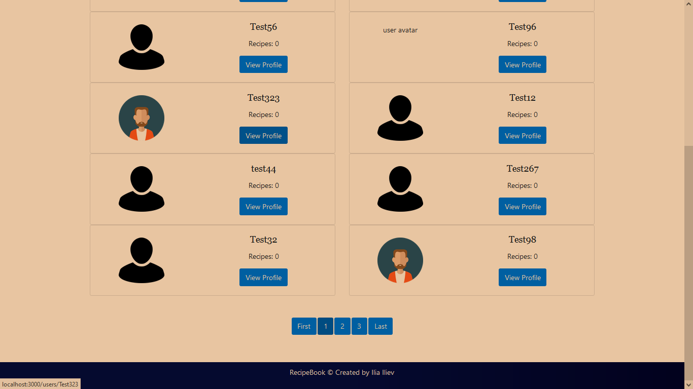
7. User Profile (url - "/users/:username")
   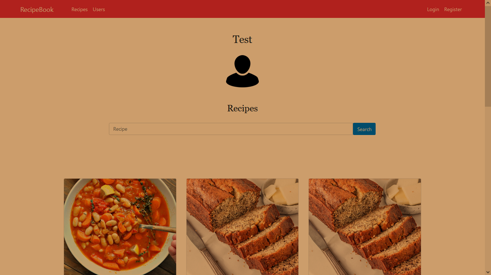
   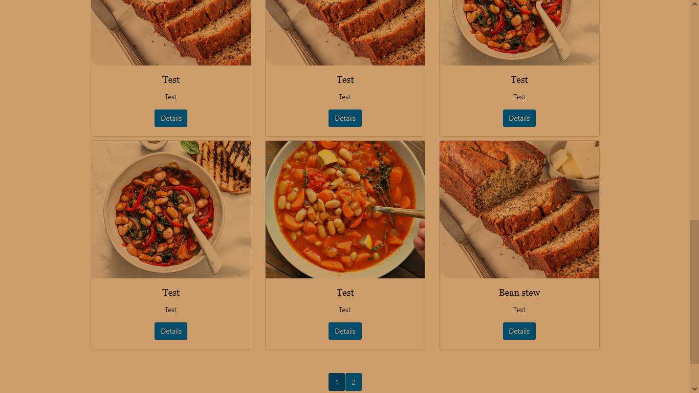

### Loged in users - everything visitors can access (minus register and login) plus:

1.  Home page (url - "/")
    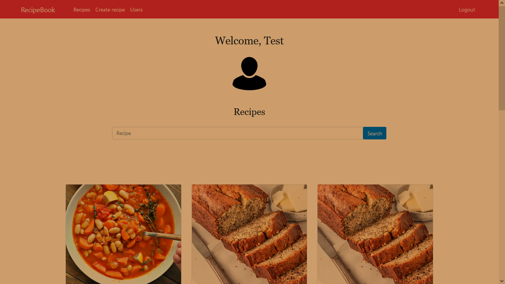
    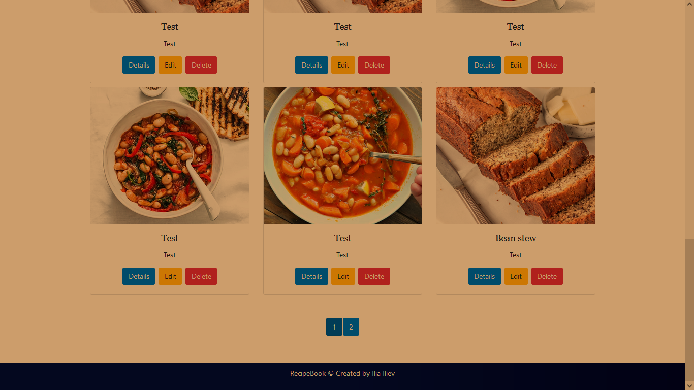
2.  Details page of a recipe created by the user (url - "/recipes/:id")
    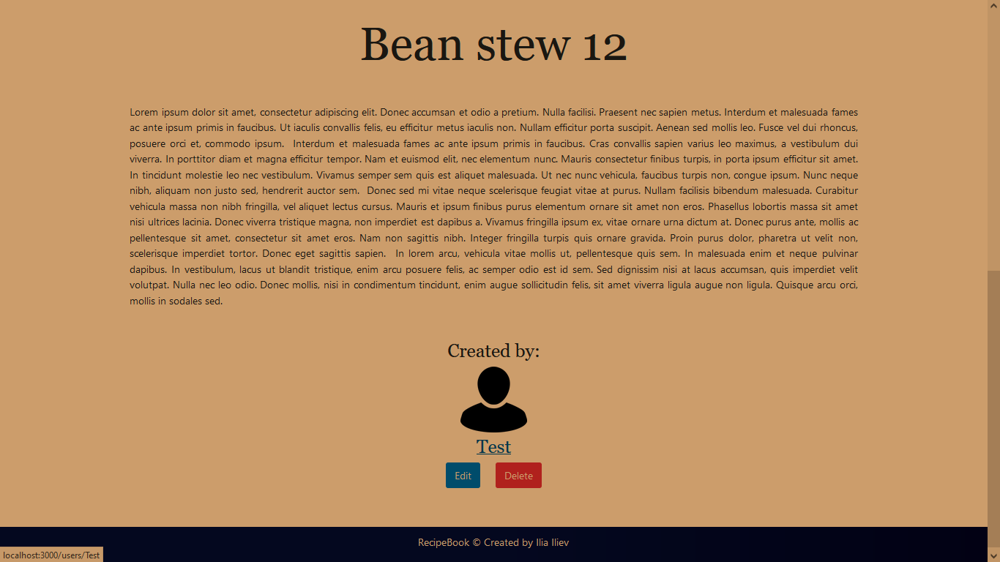
3.  Create recipe (url - "/recipes/create")
    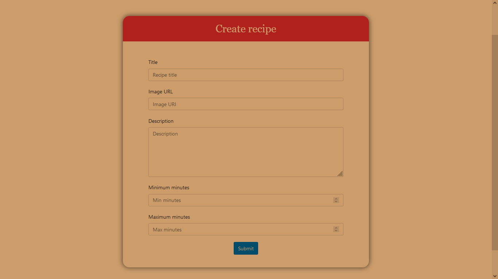
4.  Edit recipe (url - "/recipes/edit/:id")
    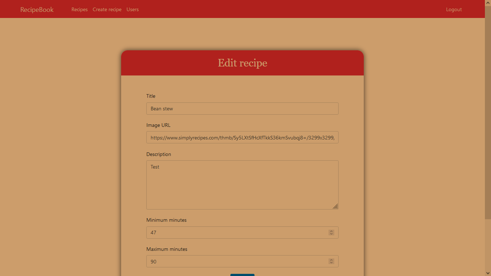
    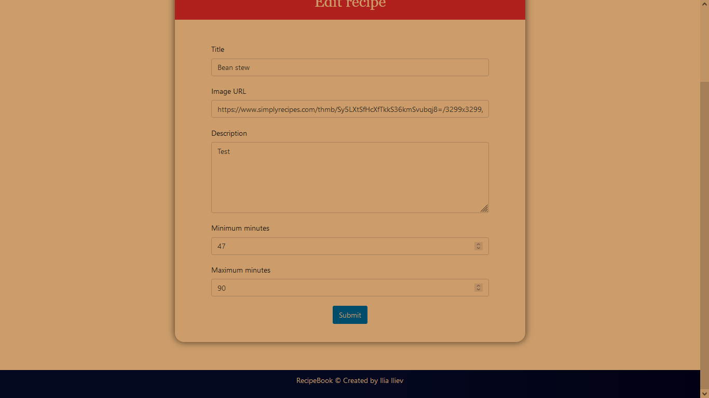
